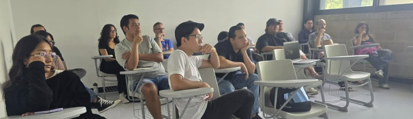

# Departamento de Matemáticas Aplicadas y Geociencias

  

Sitio web del Departamento de Matemáticas Aplicadas y Geociencias de la ENES Mérida, que tendrá el objetivo la difusión de labores institucionales del departamento. Se darán a conocer las actividades de divulgación, proyectos de investigación, trabajos de tesis para alumnos de licenciatura o posgrado que se ofertan en este departamento.

### Administrador del sitio web
Si tiene información del departamento que le gustaría publicar, o si detectó algún error que necesita corrección, contáctenos en: [edwin.perez@enesmerida.unam.mx](mailto:edwin.perez@enesmerida.unam.mx)
## License

The theme is available as open source under the terms of the [MIT License](https://opensource.org/licenses/MIT).
